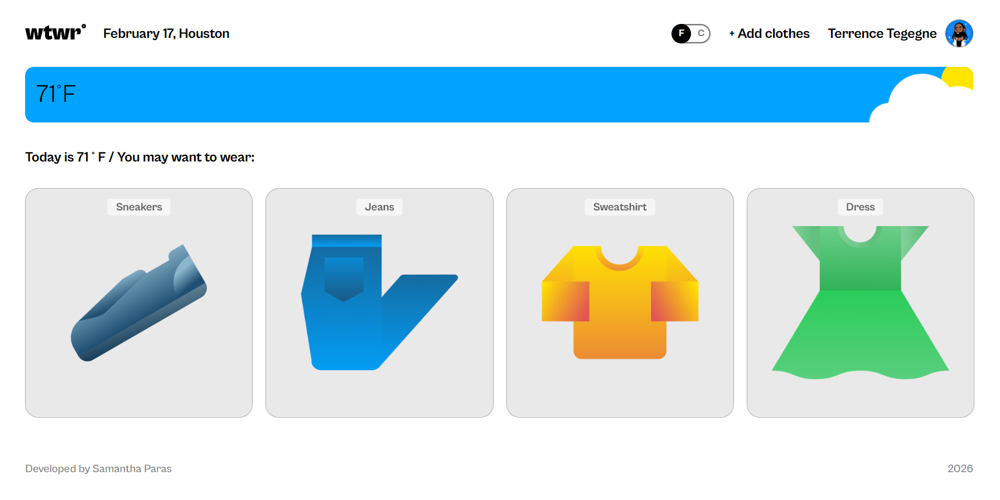
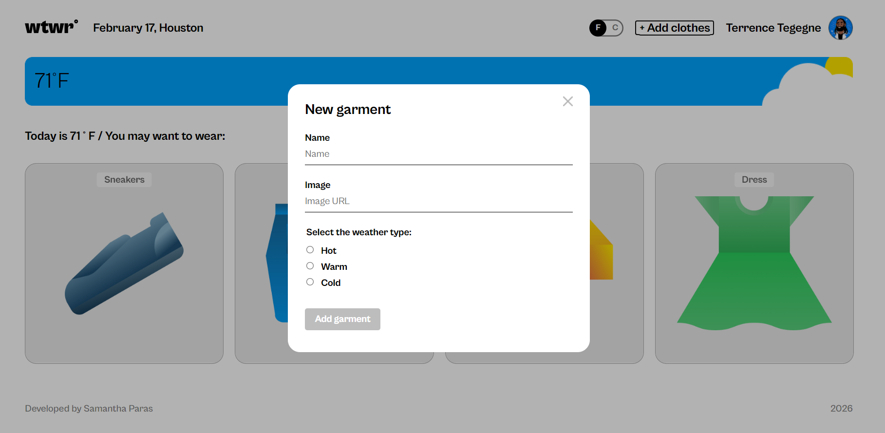
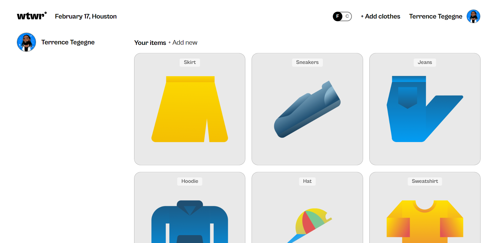
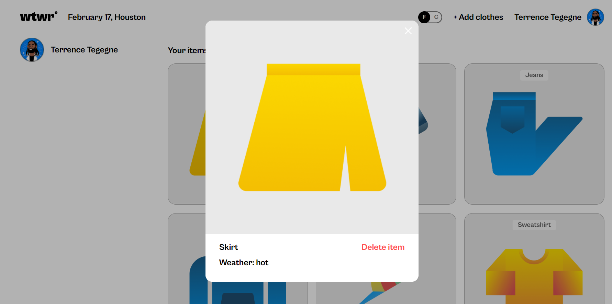
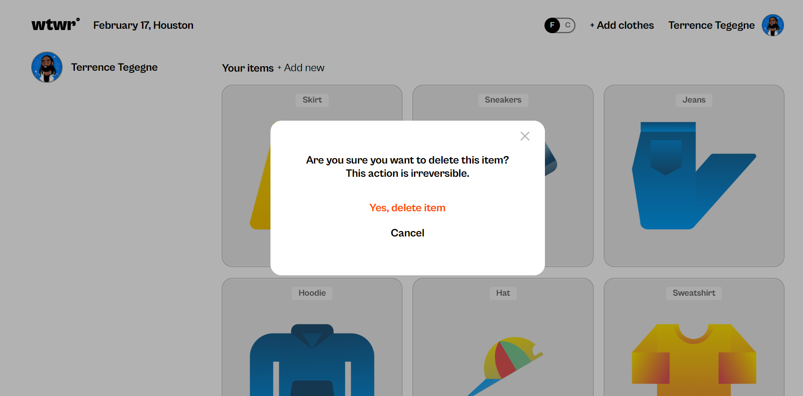

# WTWR (What to Wear?)

WTWR is a weather-based clothing app built with React. It displays the current weather for Houston, shows a weather card that updates by condition/day or night, and helps users manage clothing items for different temperature ranges.

## Functionality

- Fetches live weather data from OpenWeather and converts temperature between Fahrenheit and Celsius
- Uses a temperature unit toggle (`F` / `C`) with React Context
- Supports two routes:
- `/` for the main weather and recommended clothing view
- `/profile` for user profile, sidebar, and all saved items
- Renders clothing items from `db.json` on initial load via API calls
- Allows users to add new garments through a form modal
- Allows users to preview items and delete them with a confirmation modal

## Technologies and Techniques

- React + Vite
- React Router (`/` and `/profile` routes)
- Context API for global temperature unit state
- Custom hook: `useForm` for controlled form inputs
- Fetch API for CRUD requests to local JSON server
- OpenWeather API for current weather conditions
- CSS with BEM naming conventions
- Reusable modal architecture (`ModalWithForm`, `ItemModal`, `DeleteConfirmationModal`)

## Screenshots

Add screenshots/GIFs here to show key features.

## Demo Video

Add your demo video link here:

- [Project demo video](https://your-demo-link-here.com)

## Links

- GitHub repository: [se_project_react](https://github.com/samanthaparas/se_project_react)
- GitHub Pages (optional): [Live app](https://your-github-pages-link-here.com)

## Running the Project Locally

1. Install dependencies:
   `npm install`
2. Start the frontend:
   `npm run dev`
3. Start JSON server (if configured in your environment) to serve `db.json`:
   `npx json-server --watch db.json --port 3001`
